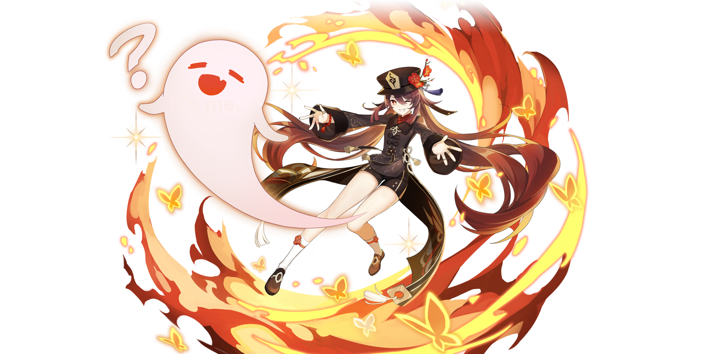

# Hu Tao


Coming soon!








## Prerelease Information

### Prefarm Information

| Material | Quantity to 90 | Quantity to 80 |
| :--- | :--- | :--- |
| Juvenile Jade | 46 | 26 |
| Agnidus Agate Gemstone | 6 | 0 |
| Agnidus Agate Chunk | 9 | 9 |
| Agnidus Agate Fragment | 9 | 9 |
| Agnidus Agate Sliver | 1 | 1 |
| Silk Flower | 168 | 108 |
| Mora | 420,000 | 300,000 |

[Click for more information on talents materials and costs.](https://genshin.honeyhunterworld.com/db/char/hutao/)

| Artifact Sets | Details/Notes |
| :--- | :--- |
| Crimson Witch of Flames \(4\) | Crimson Witch of Flames is expected to be one of her premier sets if she can reliably vaporize or melt. For pre-farming you want an HP timepiece, Pyro DMG% goblet, and a Crit helmet depending on your substats and weapon. |

Other things to note about her artifacts is that she will have extremely diluted ATK values, so HP% substats will be more worthwhile. Your priority in sub-stats is projected to be:

**Crit Rate/CritDMG &gt; HP% &gt;= EM &gt; ATK%**

The value of HP% against EM and ATK% will depend on how much Hu Tao can vaporize effectively. These numbers are extremely early and we haven't received a large amount Hu Tao footage, so take it with a ~~grain~~ bowl of salt.

