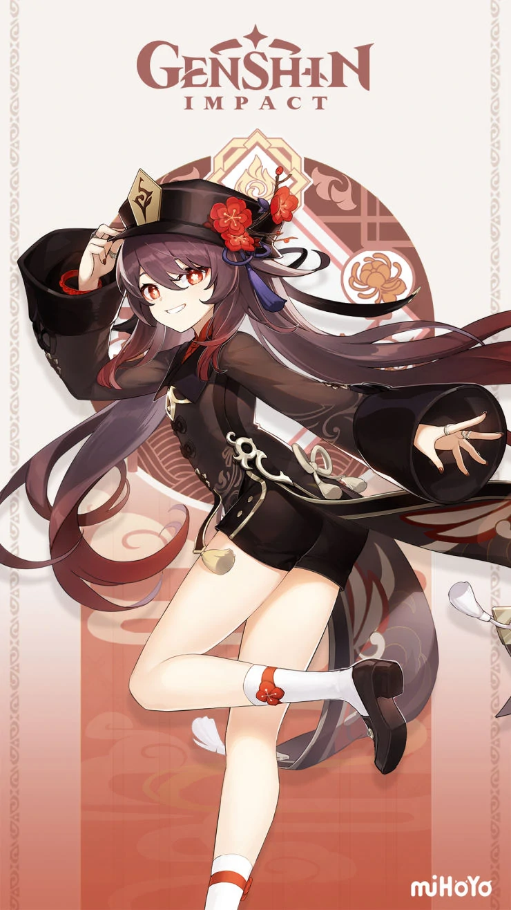
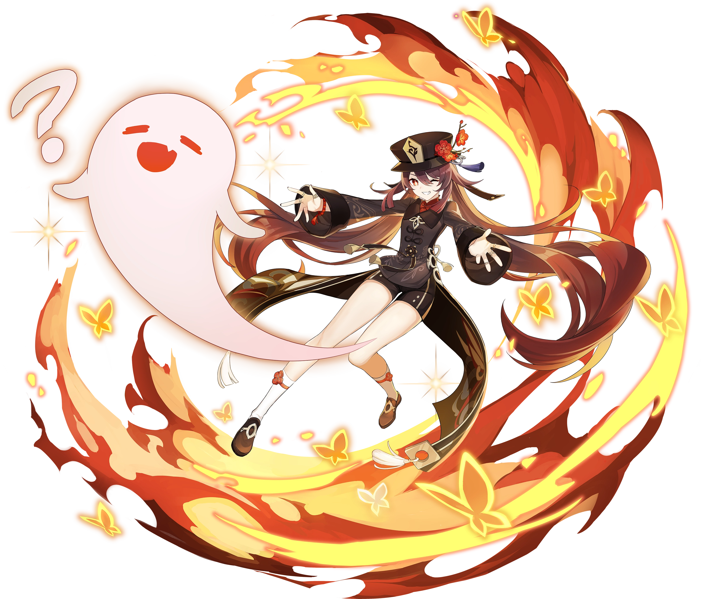
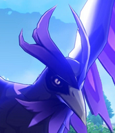

# Hu Tao

## Official Art











## **Preface**

Since the release of Hu Tao there has been intensive debate, testing and discussions regarding how strong she is, her best team compositions and exactly where she falls between the hypercarries of Genshin Impact. Her youtube portrayal has made her seem to blow a lot of her competition out of the water but admittedly, it’s a little more complicated than that.

A word you may have become familiar with since Hu Tao’s release is caveats, something she has an abundance of: _Are you in her E stance? Are you animation cancelling? Do you have stamina? Are you &lt;50%?_ If you can overcome these demands, Hu Tao rewards you with the highest single target DPS in Genshin Impact during her uptime. In this guide we will dive into the most skill intensive and skill expressive carry that has been released so far in Genshin Impact.

### **Amplification Tao:**

Hu Tao is unique to other pyro carries in that she is able to vape and melt quite consistently because she doesn't shatter like Klee or Diluc, and a separated internal cooldown of pyro application on her normal attack string and her charged attacks. Amplification Tao involves using Xingqiu and/or an additional cryo aura to enable Hu Tao to vape or melt her charged attacks on a regular basis while in her Paramita Papilio stance.

* **Pros:**
  * Cheap to build \(only a set of Crimson Witch of Flames is needed for Hu Tao\).
  * One of the highest single target damage ceilings in the game. More damage than her other compositions with much less investment required. 
  * More insurance and is generally safer if you are running freeze variations of Hu Tao due to opponents being frozen and remaining stationary. 
  * Hu Tao has the most field time, aka Hu Tao will look the best!
* **Cons:**
  * Need a highly invested Hu Tao in order to make up for teams' lack of damage.
  * At C0 Hu Tao can feel clunky and very mechanically demanding. 
    * It is required to learn charged attack cancels to come close to ceiling damage. Without C1 you won’t hit ceiling damage. N1CD not only has higher MV/s but also lets you trigger reactions at a much faster rate, increasing your damage.
  * Hu Tao's rotation has awkward misalignment with Xingqiu, leaving you in scenarios where you are waiting up to 4 seconds for his cooldowns, and with how Hu Tao's team compositions are built, your damage is practically 0 during that period.

### **Turbo Tao:**

Despite overload being awkward to work around due to smaller enemies getting sent flying in various directions, Hu Tao is one of the better users of the reaction because her charged attack will naturally chase them in most scenarios. Combine this with [Fischl’s turbo mechanics](https://www.youtube.com/watch?v=9I_NCFg-Cdw&t=123s), Turbo Tao is born. 

* **Pros:**
  * Flexible in the supports you can choose in comparison to some of Hu Tao’s other comps.
  * Less mechanically demanding than Hu Tao’s other comps as there is less need for charged attacks.
  * Allows for more consistent rotations, functioning like a quickswap composition.
  * Less reliance on Hu Tao’s individual damage as whole team can output high levels of DPS
* **Cons:**
  * Requires heavy team investment to reach damage comparable to freeze melt Hu Tao.
  * To use the composition efficiently, you must have good aura management, a decent level of knowledge and a good understanding of energy funneling.
  * Hu Tao won’t be the main carry, which can be wasted potential if she is already hyperinvested.

### **Credits:**

Raisuke\#2032  
Artesians\#0002  
Ibvfteh\#6658  
Kibokari\#830  
Sitri\#2577  
Vins\#9790  
Muakasan\#2792  
UnicornAlpha\#0128

* \*\*\*\*[**Hu Tao Mains Discord**](https://discord.gg/HuTaoMains)\*\*\*\*
* \*\*\*\*[**Keqing Mains Discord**](https://discord.gg/Keqing)\*\*\*\*
  * \*\*\*\*[**Subreddit**](https://www.reddit.com/r/KeqingMains/)\*\*\*\*

## **Talent Priority**

### **Main DPS**

Normal Attack: Secret Spear of Wangsheng &gt; Guide to Afterlife &gt; Spirit Soother 

For a sustained high field uptime playstyle, the increase from investing in Secret Spear of Wangsheng is far greater than the increase from upgrading Spirit Soother. Guide to Afterlife can be levelled alongside auto attacks but it is suggested to prioritize Secret Spear of Wangsheng.

### Burst Support

Spirit Soother &gt; Guide to Afterlife &gt; Secret Spear of Wangsheng

The goal here is to prioritise Spirit Soother as it will be your main source of damage for your nuke, while levelling Guide to Afterlife for the ATK bonus. Normal Attack: Secret Spear of Wangsheng can be ignored if you don't plan on using her after casting her Q.

## **Constellations**

#### **C1: Crimson Bouquet**

_While in Paramita Papilio state activated by Guide to Afterlife, Hu Tao's Charge Attacks do not consume stamina._

Provides roughly a 15% DPS increase IF you efficiently use N1CD \(normal attack 1, charged attack, dash & repeat\). Also provides a lot more safety with an abundance of invulnerability frames as you dash cancel. Overall, it's a great quality of life constellation and one of the best first constellations in the game.

#### **C2: Ominous Rainfall**

_Increases the Blood Blossom damage by the amount equal to 10% of Hu Tao's max HP at the time the effect is applied. Additionally, Spirit Soother will also apply the Blood Blossom effect_**.**

A decent DPS increase but nothing game breaking. Gives her more ability as a burst support.

**C4: Garden of Eternal Rest**

_Upon defeating an enemy affected by Blood Blossom that Hu Tao applied herself, all nearby allies in the party \(excluding Hu Tao herself\) will have their critical rate increased by 12% for 15 seconds._

This is probably the second best constellation on Hu Tao. C4 enables her sub DPS potential to explode. Killing an enemy with Q while E is active, even if blood blossom wasn’t previously applied will still trigger this.

#### **C6: Butterfly's Embrace**

_Triggers when Hu Tao's HP drops below 25%, or when she suffers a lethal strike - Hu Tao will not fall as a result of the damage sustained. Additionally, for the next ten seconds, all of her elemental and physical resistance is increased by 200%, her critical rate is increased by 100%, and her resistance to interruption is greatly increased. This effect triggers automatically when Hu Tao has 1 HP left. Can only occur once every 60 seconds._

A pretty decent safety net, and although Hu Tao is a character that will naturally have a lot of HP in addition to self heal, she will often find herself in a lot of low HP situations. It is a great QoL constellation to have, but its true power lies in low Crit Rate and high Crit DMG builds with her nuke compositions. This is the best speedrunning constellation, but overall is not impactful for her main DPS capabilities because of the 60 second lockout.

## **Weapons**

The Staff of Homa is by far Hu Tao’s best weapon, but she is surprisingly quite flexible and has some other decent options when it comes to her weaponry. Several 4-star options are viable or some surpass some of the 5 star options. All of the damage is calculated with Vaporize DPS.

| **Weapons / Refinements / Conditions** | Perfect Substats | Main Stat Only | **Notes** |
| :--- | :--- | :--- | :--- |
| **Staff of Homa &lt;50%** | 128.1% | 124% | Homa can be a 30% DMG increase at optimal stats. |
| **Lithic Spear R5 +4 Liyue** | 113.1% | 114.8% |  |
| **Dragon's Bane R5** | 109.8% | 116.9% |  |
| **Primordial Jade-Winged Spear +7 Stacks** | 108.3% | 109.8% | 7 Stacks is fairly unreasonable. |
| **Dragon's Bane R1** | 102.4% | 109% | With full uptime on its passive, Dragon's Bane is impressive. |
| **Deathmatch \(solo\)** | 101.7% | 101.8% |  |
| **PJWS +6 Stacks** | 101.4% | 102.7% |  |
| **Blackcliff Polearm +3 Stacks** | 101.4% | 99.4% |  |
| **Vortex Vanquisher \(Shielded\) +5 Stacks** | 100.5% | 103.4% | Probably not worth the effort compared to Deathmatch. |
| **Deathmatch \(2+ enemies\)** | 100% | 100% |  |
| **Lithic Spear R1 +4 Liyue** | 98.7% | 100.7% | +3 Liyue is also better than Blackcliff Pole |
| **White Tassel R5** | 93.5% | 94.1% | A 3\* weapon makes its appearance. |
| **Blackcliff Polearm**  | 93.4% | 91.1% |  |
| **Skyward Spine** | 93.2% | 94.9% | Energy recharge on Hu Tao isn't particularly useful. |
| **Dragon's Bane R1 \(no passive\)** | 93.2% | 99.2% | Just for reference, no DMG% is shown to see how low Dragon's Bane can fall. |
| **Lithic Spear R1 +2** | 91.9% | 93.7% | Worst case scenario for Vape Hu Tao. |

Calculations done by Muakasan\#2792. 

#### Assumptions

* Rotation is 5 N3C + Burst + 1 Blood Blossom. 
* Hutao is level 80/90, with talent level 8,  and less than 50% HP.
* Level 90/90 weapons,. 

See [this sheet](https://docs.google.com/spreadsheets/d/1P1QqLKFK1utVs-eXqeEBl3P1rEOHTjz-JGw2oMeIBkQ/edit#gid=0) and [code ](https://github.com/Muakasan/genshin/blob/main/hutao_weapons.py)for more details. Vaped abilities based on [this sheet](https://docs.google.com/spreadsheets/d/1VpANxYlBWbYRdoI1lMJVx0lwAM-HOzrNBnV8QzMR1yE/edit#gid=0). Note for Dragon’s Bane, no DMG% bonus is not realistic because there must be hydro aura to vape, but we wanted to show an approximation of the ranking in a non-vaporize composition. [Additional weapon resources](https://docs.google.com/spreadsheets/d/1RxdPAfiylKZ7OvyE45yph7VrgwLY8xM0ytnxjV_k-IM/htmlview?pru=AAABeBtchko*e7A5D0WgtebbghoFq45fPg#gid=378612281) by Zakharov.

### Expanded Weapon Notes

**Staff of Homa** - As you’d expect, Hu Tao’s signature weapon is also her best in slot . Due to Hu Tao’s low base ATK she doesn’t value ATK% like other characters would, so Homa's 66.2% Crit DMG and HP scaling passive make it the perfect weapon for her. Compared to other weapons it also refines fantastically at around 5% DMG per refine.  
  
**Primordial Jade Winged-Spear** - Like with all polearm users currently, the PJWS is an excellent option especially if you do not have the Staff of Homa. Maintaining max stacks is important for using the weapon efficiently \(it falls behind Deathmatch without it\) which is unfortunately difficult to keep up and maintain on Hu Tao.  
  
**Deathmatch** - One of Hu Tao’s best available 4 stars and competes for 2nd BiS. It is a huge Crit Rate stat stick which is where most of its value lies. The ATK% gives marginal returns on Hu Tao. It refines very poorly so it’s not suggested to pick up multiple from the battle pass. The Crit Rate is still extreme valuable despite its problems.

**Dragon's Bane** - Scales very well with refinements and is another contender for her 2nd BiS. You must be consistently triggering reactions \(Vape/Melt\) with this weapon or its effectiveness will significantly decrease. Overall, it's a more situational weapon but is a great choice if used correctly and **its greatest challenge is having enough Crit substat rolls.**  
  
**Vortex Vanquisher** - With both its substat and passive being ATK% makes is incredibly unattractive for Hu Tao. She will always prefer Crit, HP% or even Elemental Mastery over ATK%. You must be shielded to use this weapon to its max potential which makes it an inconsistent choice unless you have Zhongli.  
  
**Lithic Spear** - Can be a very good weapon for Hu Tao at R5 with 4 characters but this can be quite difficult to achieve as it limits your team compositions a lot \(No VV support from Liyue\). Consider using another weapon unless you can achieve these requirements or are out of options.

**Blackcliff Polearm** - Probably Hu Tao's best "F2P" option. It slightly edges out Deathmatch at full stacks but the difficulty of achieving and the impracticality of maintaining the stacks consistently makes it a lesser option than Deathmatch.  
  
**Skyward Spine** - The energy recharge stat and attack speed boost isn’t effective enough on Hu Tao to justify using this over the above weapons. It should only be used if you have no other options, otherwise it is not recommended.  
  
**White Tassel** - A surprisingly decent F2P option but only to be used if you have no other options. Using this weapon your combos need to be normal attack focused or it loses even more value.  
  
**Black Tassel** - The HP% is nice but it doesn’t make up for the terrible passive. If you must run a 3 star weapon, White Tassel is a superior option.

## Artifacts

| Artifact Set | Description |
| :--- | :--- |
| **Crimson Witch of Flames \(4\)** |  Despite Hu Tao not being able to make full use of the 4PC effect it’s still BiS and surpasses any other options. |
| **Retracing Bolide \(4\)** | Strictly less damage than CW or LW but a very decent option if you are protected by a shield for most of her rotation. Naturally very good with Zhongli. |
| **Lavawalker \(4\)** | BiS in mono Pyro compositions with Geo/Anemo support. A decent option in Turbo Tao comps as you want to maintain a Pyro aura. |

#### Transitional Artifact Sets

| Artifact Set | Description |
| :--- | :--- |
| **Crimson Witch of Flames \(2\) + Wanderer's Troupe \(2\)**               | Provides a strong EM bonus for Hu Tao that is fairly strong for her reactions. This set has the potential to catch up to Crimson Witch of Flames \(4\) if you have better substats. |
| **Crimson Witch of Flames \(2\) + Noblesse Oblige \(2\)** | Pushes her burst damage just a little more. |
| **Crimson Witch of Flames \(2\) + Gladiator's Finale \(2\)** | ATK% is just not ideal, but if you have some good pieces lying around, why not. |

See Muakasan\#2792’s [Sheet ](https://docs.google.com/spreadsheets/d/1QQBf0RgblbASDrYTCZj4AkI1dNlzfztJS4986M5PWis/edit#gid=0)and [Code ](https://github.com/Muakasan/genshin/blob/main/hutao_weapons.py)for more details. Same assumptions as weapon comparison.

### Main Stats and Substats

The standard recommendation for main stats is HP sands, Pyro DMG goblet, and Crit circlet. For vaporize or melt reaction comps, EM sands is a viable alternative that can provide more damage, at the cost of flexibility and a smaller health pool to work with.

The exact breakpoint between HP and EM sands depends on your preferred playstyle, EM substats, and whether you use an EM buffer such as Sucrose, Albedo, or 4PC Instructor’s set. 

Contrary to popular belief, you do not need ANY HP% to make EM sands better. If you are unsure of which to run, it is always safer to input your stats into a [calculator.](https://frzyc.github.io/genshin-optimizer/#/) As a very approximate rule of thumb, if your total EM from all sources is less than 250 \(main DPS\) or 300 \(burst\), you will get more damage from EM sands. For EM values in the 150-250 range, you may consider sticking to HP sands for more consistency and tankiness at the cost of a few percent DPS.

For reaction comps, the substat priority is \(including external buffs like Sucrose for EM\):

> EM\(&lt; 100\) &gt; CR/CD &gt; EM\(100 ~ 300\) &gt; HP &gt; ATK &gt; EM\(300+\)

For non-reaction comps, EM is useless, so remove it from the rankings.

You should not fear ATK%, as it also provides some DPS gain, especially when using weapons with high base ATK. You can compare the relative gains from HP% and ATK% on [Desmos](https://www.desmos.com/calculator/ahjsakifr3). Reaching the HP to ATK conversion cap of 400% is not advisable since Crit substats always provide more damage than HP substats.

## **Team Compositions**

Hu Tao comps can be classified into two main categories: Amplification Tao and Turbo Tao. These two compositions function very differently and have different artifact sets and substats priority. Their functionality is focused around two core units that you must have in order to play them to anywhere near their potential, butbelow will be a small sample to help guide you in building your team compositions.

## **Amp Tao**

**Hu Tao / Xingqiu / Augment / Support**

Amplification Tao comps function around enabling Hu Tao to proc as many Vaporize and Melt reactions as possible. At first glance, this is no different from other Pyro carries \(Diluc and Klee\)  with their Vaporize compositions, but Hu Tao has the added benefit of having slow enough of Pyro application to actively Vaporize. This comp has to be played around Xingqiu’s 21s Burst cooldown, making sure Xingqiu is a part of every rotation is important to keep Amp Tao running efficiently and effectively.

<table>
  <thead>
    <tr>
      <th style="text-align:center">Unit</th>
      <th style="text-align:left">Notes</th>
    </tr>
  </thead>
  <tbody>
    <tr>
      <td style="text-align:center">
        

          
        

        
<b>Hu Tao</b>
        

      </td>
      <td style="text-align:left">Hu Tao compositions would obviously feature Hu Tao. She&apos;s very strong
        as a Charged Attack spammer with animation cancels. Her ceiling bounces
        around depending on the time you put into her.</td>
    </tr>
    <tr>
      <td style="text-align:center">
        

          
        

        
<b>Xingqiu&apos;s Left Rainsword</b>
        

      </td>
      <td style="text-align:left">Xingqiu is currently the only unit in the game that can apply Hydro fast
        enough for Hu Tao&apos;s attacks. His subtle healing, damage reduction,
        and stagger resistance are all of great use for Hu Tao. It is a shame that
        his cooldowns are desynced with Hu Tao&apos;s.</td>
    </tr>
  </tbody>
</table>

### **Augment Slot**

For the first fill slot, you can use a variety of characters depending on the type of composition and investment you have that will change the composition's identity sharply.

<table>
  <thead>
    <tr>
      <th style="text-align:center">Unit</th>
      <th style="text-align:left">Notes</th>
    </tr>
  </thead>
  <tbody>
    <tr>
      <td style="text-align:center">
        

          
        

        
<b>Bennett</b>
        

      </td>
      <td style="text-align:left">Lower damage ceiling than the Xiangling variation, but Bennett is much
        more consistent and safer. Bennett is not needed to make Hu Tao strong,
        but his presence in a party isn&apos;t a drawback either. A well invested
        Bennett (giving 800-900 ATK) will compensate for the loss of Pyro DMG%
        Bonus and low HP damage on her Ascension passive and Spirit Soother.</td>
    </tr>
    <tr>
      <td style="text-align:center">
        

          
        

        
<b>Xiangling</b>
        

      </td>
      <td style="text-align:left">This variation has an incredibly high damage ceiling, especially with
        Xiangling being a strong complement to Hu Tao&apos;s AoE issues. However,
        since it is energy-hungry and not very sustainable, it is suggested to
        run a 4th member with battery capabilities/Favonius Weapon carrier to make
        it more sustainable. One thing to note is unless your Xingqiu is C6, N1C
        Hu Tao + Xiangling overtakes aura, and it will stay pyro aura until rotation
        reset with Xingqiu. With non C6 Xingqiu, it is recommended to do N3C for
        consistency, with C6 XQ, you can do N1C for higher damage.</td>
    </tr>
    <tr>
      <td style="text-align:center">
        
         <b>Ganyu</b> 
      </td>
      <td style="text-align:left">For whales or mobile player, and those who have a spare Ganyu that they
        do not need or want to slot as the main DPS on their 2nd Abyss team. Ganyu
        is the more foolproof, more expensive, and less efficient Kaeya, power
        budget-wise. Ganyu Q runs on a 15s duration, longer than Hu Tao&#x2019;s
        realistic E duration, meaning you have access to Melts throughout your
        DPS uptime, and mistakes aren&#x2019;t as costly. She also deals considerable
        damage during Hu Tao&#x2019;s off time, that you can use her as a pseudo
        &#x201C;sub DPS&#x201D;. However, Ganyu is the best DPS in the game right
        now, and using her as an enabler for Hu Tao is frankly quite wasteful of
        her potential.</td>
    </tr>
    <tr>
      <td style="text-align:center">
        
         <b>Kaeya</b> 
      </td>
      <td style="text-align:left">Since Hu Tao does not shatter on attack unlike Klee and Diluc, Hu Tao
        can be run in a Melt comp for a higher damage ceiling than Vape, while
        also being considerably safer due to constant Freezing. Kaeya is a cheap,
        straightforward, and efficient choice here with his off-field Cryo application.
        It is recommended to run an Instructor (4) or Noblesse Oblige (4) on him
        to buff Hu Tao, depending on your fourth slot. However, his Q only runs
        on an 8s duration, so you want to cast his burst right before you swap
        onto Hu Tao.</td>
    </tr>
  </tbody>
</table>

### Support Slot

Hu Tao has a wide cast of supports that she can effectively utilize with her augmenters. 

<table>
  <thead>
    <tr>
      <th style="text-align:center">Unit</th>
      <th style="text-align:left">Notes</th>
    </tr>
  </thead>
  <tbody>
    <tr>
      <td style="text-align:center">
        <b>Worse Venti </b>
      </td>
      <td style="text-align:left">Sucrose<b> </b>is valuable as an Elemental Mastery battery and sees more
        value here with Bennett or Xiangling in her third slot. When you use Sucrose,
        you can forgo EM investments if your Sucrose is strong enough. These compositions
        value a hyper-invested Hu Tao to avoid running out of steam.</td>
    </tr>
    <tr>
      <td style="text-align:center">
        

          
        

        
<b>Chongyun</b>
        

      </td>
      <td style="text-align:left">The riskier, but higher damage option. Chongyun&#x2019;s personal damage
        is much higher than Diona&#x2019;s, and with C2, he helps to smoothen out
        her rotation and uptime with Xingqiu by reducing the cooldowns on Xingqiu.
        This is highly valuable on a unit with awkward cooldowns misalignment with
        her key support. The attack speed buff is a cherry on top. However, this
        comp cuts off your insurance and makes Hu Tao gameplay a lot riskier. Only
        recommended for C1 Hu Tao and above users.</td>
    </tr>
    <tr>
      <td style="text-align:center">
        

          
        

        
<b>Diona</b>
        

      </td>
      <td style="text-align:left">Even though Freeze comps are generally safe, a healer like Diona gains
        a lot of value in a Hu Tao comp. She helps battery the Cryo applicator,
        keeping Hu Tao DPS uptime as consistent as possible. Give stamina buff,
        and provide healing for a stamina-hungry unit who might not be able to
        dodge. Heavily recommended for C0 Hu Tao users.</td>
    </tr>
    <tr>
      <td style="text-align:center">
        

          
        

        
<b>Zhongli</b>
        

      </td>
      <td style="text-align:left">Zhongli, as always, is just an overall great unit that fits everywhere.
        Omnishred sees more value here as there can be up to 3 damage types, and
        shield is great insurance that offers increased effective health and knockback
        resistance. You can also pair him with Albedo, surprisingly, the Hydro
        aura gauges are not depleted too fast.</td>
    </tr>
    <tr>
      <td style="text-align:center">
        

          
        

        
<b>Venti</b>
        

      </td>
      <td style="text-align:left">Venti is Venti, Hu Tao being able to hit enemies in Venti&#x2019;s ult
        sometimes makes the combo even more bonkers in mob content, but occasionally
        he will grief Hu Tao depending on his level and the content.</td>
    </tr>
    <tr>
      <td style="text-align:center">
        

          
        

        
<b>Mona</b>
        

      </td>
      <td style="text-align:left">
        

        
Mona becomes a very viable option with Hu Tao&apos;s strong Q scaling.
          Mona and Bennett are a famous nuke duo, and they transfer their specialty
          well. With proper setup around Hu Tao Q, you can hit some great bursts.

      </td>
    </tr>
    <tr>
      <td style="text-align:center">
        

          
        

        
<b>Jean</b>
        

      </td>
      <td style="text-align:left">Viridescent Venerer and healing.</td>
    </tr>
  </tbody>
</table>

## Turbo Tao

Turbo Tao’s gameplay and win condition revolves around abusing Fischl Turbo mechanics. When Fischl \(Oz\) triggers Overload or Superconduct, she gives 1 electro particle/enemy hit. By building a team around giving Fischl as much Pyro/Cryo aura to proc this mechanic as much as possible, we get a team that has incredible energy gains and can spam impactful ultimates. Turbo Tao lives and dies by how much Turbo you can trigger, so you have to manage aura well, but generally, it is a much more flexible composition in both team choices and playstyle as you are not gated by energy. The more impactful Elemental Bursts you can spam, the closer you are to the win condition.

<table>
  <thead>
    <tr>
      <th style="text-align:center">Unit</th>
      <th style="text-align:left">Notes</th>
    </tr>
  </thead>
  <tbody>
    <tr>
      <td style="text-align:center">
        

          
        

        
<b>Hu Tao</b>
        

      </td>
      <td style="text-align:left">Hu Tao compositions would obviously feature Hu Tao. She&apos;s very strong
        as a Charged Attack spammer with animation cancels. Her ceiling bounces
        around depending on the time you put into her. For Turbo, her Pyro application
        is what makes or breaks the composition.</td>
    </tr>
    <tr>
      <td style="text-align:center">
        

          
        

        
<b>Fischl&apos;s Toucan</b>
        

      </td>
      <td style="text-align:left">Fischl is the second cornerstone unit that can be utilized with Hu Tao.
        The turbo mechanic allows you to generate insane amounts of energy for
        the rest of the team. The energy abundance lets you abuse Beidou and Xiangling
        sub DPS.</td>
    </tr>
  </tbody>
</table>

### Overload Hu Tao

Core of all OL Turbo Tao comps. Xiangling is still generally underrated as a unit, mostly due to her atrocious energy demand, but with Turbo solving this issue, she rises up as a contending unit with insane AoE and the best off field Pyro applicator in the game. One thing to note is this composition has a lot of knockback on small enemies due to overload, and with Hu Tao limited uptime, chasing is suboptimal for her damage. Unlike its cousin SC Turbo, OL Turbo is less strict in team comps.

<table>
  <thead>
    <tr>
      <th style="text-align:center">Units</th>
      <th style="text-align:left">Notes</th>
    </tr>
  </thead>
  <tbody>
    <tr>
      <td style="text-align:center">&lt;b&gt;&lt;/b&gt;
        
         <b>Xingqiu</b>
      </td>
      <td style="text-align:left">Unlike most other non-turbo applications of using XQ for setting up vapes,
        the energy gained from turbo drops the necessary ER requirements to allow
        him to potentially run more damage in his artifact mainstats/substats or
        even run a 5 star weapon instead of Sacrificial sword. The hydro will sometimes
        overtake the pyro and you will instead Vape and OL at the same time reducing
        your overall number of turbos. However, amping the damage of your HT and
        XL are definitely worth missing out on some of the overloads.</td>
    </tr>
    <tr>
      <td style="text-align:center">
        

          
        

        
<b>Beidou</b>
        

      </td>
      <td style="text-align:left">This team totally forgoes amping in favor of including a Beidou who will
        run little to no ER and leverage her massive base damage burst (especially
        at c2). Unlike the other turbo builds this build does not compromise on
        turbo and therefore has the lowest ER requirements of them all. Beidou
        is particularly suited to content with 2 or 3 large units that tend to
        stay close together and maximize the mv/s of her burst. However, to maximize
        Beidou you must learn how to profitably switch parry on reaction which
        may take some practice.</td>
    </tr>
  </tbody>
</table>

### Superconduct Hu Tao

Every Superconduct Turbo Tao comp uses Fischl and Kaeya. Kaeya is a must in SC Turbo, as no one in the current content beats his Cryo application rate, except for grouped mobs Ganyu + Venti. The last spot can be Ganyu or Diona, and potentially Rosaria, though we need direct tests to confirm her spot here. This composition has enough cryo for Hu Tao to both Melt with charged attacks and proc SC Turbo with Fischl, which is both stable and gives a high damage ceiling. However, there are caveats depending on which variation you run.

<table>
  <thead>
    <tr>
      <th style="text-align:center">Unit</th>
      <th style="text-align:left">Notes</th>
    </tr>
  </thead>
  <tbody>
    <tr>
      <td style="text-align:center">
        
         <b>Ganyu</b>
      </td>
      <td style="text-align:left">The most stable composition, aura wise. Ganyu and Kaeya provide enough
        Cryo that you can comfortably N1C Melt and still SC Turbo freely with Fischl.
        Ganyu, as always, has high personal DMG to be default to during downtimes.
        However, this is a risky comp with no insurance, only recommended for high
        investment + C1.</td>
    </tr>
    <tr>
      <td style="text-align:center">
        
&lt;b&gt;&lt;/b&gt;
          <b> </b>
        

        
<b>Diona</b>
        

      </td>
      <td style="text-align:left">The safer composition of the two variations. Diona gives a lot of valuable
        insurance and utility, making the experience for C0 Hu Tao much better.
        However, Diona might not apply enough Cryo without extensive E taps and
        switching compared to Ganyu, another deterrent if you have C1 Hu Tao, whose
        higher Pyro application comes with higher damage potential.</td>
    </tr>
    <tr>
      <td style="text-align:center">
        

          
        

        
<b>Xingqiu</b>
        

      </td>
      <td style="text-align:left">A unique variation of Turbo Tao. Unlike other Turbo variations which focus
        on one single Turbo type (Superconduct or Overload), this comp can use
        both Turbo in a rotation. However, due to the sheer amount of reaction
        types in this comp (Freeze, Melt, Vape, Superconduct, Overload, Electrocharged
        all in one rotation), it is impossible to control your energy generation
        and aura, but the Turbo procs gives enough energy, as well as very good
        reaction damage making it a viable comp. However, this is a risky comp
        with no insurance, only recommended for high investment.</td>
    </tr>
  </tbody>
</table>

## Alternative Team Compositions

### PP Tao

Surprisingly, pure Pyro is actually viable. Testings have shown even with the lack of reactions, C1 Xiangling Pyro shred and Bennett buffs in one team can give very competitive clear times in end game content. You can run Zhongli with another Geo \(Albedo for example\) for the Geo resonance buffs, or run 3 Pyro + 1 VV carrier \(Any combination between Xiangling, Bennett, Diluc for 2 pyro slots works\).

<table>
  <thead>
    <tr>
      <th style="text-align:center">Team Composition</th>
      <th style="text-align:left">Notes</th>
    </tr>
  </thead>
  <tbody>
    <tr>
      <td style="text-align:center">
        
         <b>Triple Pyro</b>
      </td>
      <td style="text-align:left">With C1 Xiangling to shred Pyro RES, Bennett to battery, heal, and buff
        ATK, this composition is fairly straight forward. Any Anemo character works
        in the last slot for Viridescent Venerer.</td>
    </tr>
    <tr>
      <td style="text-align:center">
        

          
        

        
<b>Double Geo</b>
        

      </td>
      <td style="text-align:left">This composition utilizes the strong Geo resonance effect with Xiangling&apos;s
        C1 Pyro RES shred, on top of Zhongli&apos;s omni-RES down. You can also
        slot in Archaic Petra (4) to increase the Pyro DMG bonus. You can also
        replace Albedo to run a &quot;microwave&quot; composition with extra Crit
        rate at C6 Geo MC.</td>
    </tr>
  </tbody>
</table>

### Dual Carry Hu Tao

Both Hu Tao and Childe have great burst damage during their uptime, but are balanced out by uptime issues. However, by running them together, this weakness is greatly relieved. Childe running on a 7-8 second E rotation matches Hu Tao downtimes, and together they keep consistent DPS. Last 2 slots are flexible, and can be filled with either supports for Hu Tao or Childe. Some candidates are: Xingqiu, Fischl, Xiangling, Beidou, Bennett, etc.

### Nuke Tao

Hu Tao, not only at C6, has an incredibly strong burst that scales well and importantly, is Pyro. Hu Tao having very inherently high ATK and crit stat values makes her uniquely suited for nuke/one shot compositions. Her Burst also has very low frames and high MV/s values, making her perfect for speedruns. These compositions require very strong undestandings of the game and rotating different buffs on top of optimized rotations.

| Team Composition | Notes |
| :--- | :--- |
|   | The current world record speedrun comp. Sucrose provides VV and EM for Hu Tao to oneshot everything with her Burst. Ganyu is generally the best cryo applicator, but Chongyun is a viable alternative in single target scenarios. |
|   | The usual double Vape speedrun comp. However, instead of Bennett proc-ing Mona’s Bubble, it's Hu Tao. Childe can be replaced by Sucrose if the goal is to boost Hu Tao’s numbers as high as possible. |

## **How To Play Hu Tao** 

Hu Tao is similar to Xiao and Ganyu, in the sense that she was designed with very specific limiters on her capability as a main DPS. Like Ganyu's aiming and Charged Attacks or Xiao's battery issues and greediness, Hu Tao comes with a suite of problems that have to be addressed. She cannot just spam Charged Attacks without thinking because of how unwieldy the dash is, so you have to perform jump cancels at C0, or dash cancels at C1. It is not recommended to dash cancel without C1, as you can only perform 4-5 of them without the stamina saved from her constellation 1.



On top of the Charged Attack cancels, she also has input buffering mechanics that allow her to input very quick attacks. With non-spam inputs, as in one click per attack, Hu Tao can cancel the animation of her second attack \(N2\) with a Charged Attack to perform her N2C combo.



It is in general,  a straight damage increase directly from the frames saved from jumping or dashing after she blinks after her Charged Attack or indirectly from avoiding the massive displacement from her Charged Attack. In terms of efficiency, the best combos to do are her N1C, which is the most stamina hungry, N2C, which has the theoretical highest amount of damage, and her N3C, which has the most AoE and Hydro application with Xingqiu's burst. As for timing, Hu Tao's Charged Attack will always go through if the attack is cancelled after she blinks off screen.



## **Changelog**

3/11 Draft

**Planned:**

