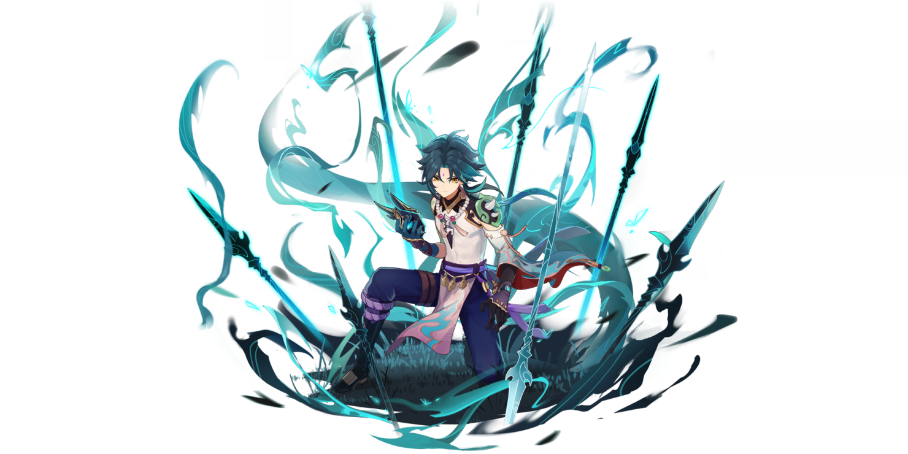

# Xiao

## Official Art















## **Preface**

These past few days have been kind of rough for Xiao in the theorycrafting universe in contrast to his YouTube portrayal. You might have questions like whether or not Xiao is stronger or weaker than Diluc or Klee or Ganyu. This guide will try to provide you with an objective look at how Xiao plays.

Before we continue, it should be noted that there are three versions of Xiao. He has damage profiles that are **worlds apart** depending on how well you are invested. With a _minimum_ investment at ascension 5 with proper talent levels, he is as strong as Keqing. At hyper investment at ascension 6 and 9+ talents, Xiao is competitive as a top 4 DPS in Genshin. At C6, Xiao is unchallenged as the new premier DPS unit against 2+ enemies.

### **Minimum Investment:**

Level 70-80 Xiao, level 7+ talents, Favonius Lance+, and a lot of energy recharge **\(run an ER timepiece\).**

* **Pros:**
  * Keqing levels of damage, very strong DPS as a 5\* unit, and has respectable uptime despite the 70 energy cost that may seem daunting.
  * In general, a strong unit because he bypasses shields with easy access to plunge damage spam that has **strong AoE** and allows you to **dodge damage**.
  * Can play to abuse Anemo infusion or high damage multipliers with strong MV/s, so he isn’t slowed down by elemental enemies.
  * Can permanently stagger Fatui enemies with low plunge, and makes quick work of them.
  * Mobile friendly with plunges, but your mileage may vary \(test him out in the trial!\)
  * You can utilize an ATK% Goblet without losing much damage.
* **Cons:**
  * If you have access to Ganyu, Diluc, or Klee, pushing Xiao towards their damage requires more investment into him.
  * Very limited team compositions, where the units that can play well with Xiao have to fulfill pretty specific roles.
  * Requires a very strong ability to manage energy with Xiao and it can be a little more intensive than you would have with other carries.
  * **Energy issues - high cost & no energy generation during burst may require most players to prioritize ER% more than most other main DPS carries.**
  * Getting knocked out of your plunges or being staggered causes your DPS to fall off a cliff.
  * Virtually _**impossible**_ to farm Gladiator’s Triumph, at Adventure Rank 55, it’s 40 resin for a 50/50 for Gladiator or WT - but you only need 2.

### **Hyper Investment:**

Level 80-90 Xiao, level 10 talents, Deathmatch+, and optional levels of energy recharge.

* **Pros:**
  * Approaches the big three in terms of damage output.
  * Xiao will kill things so fast, that energy recharge truly becomes optional as you absorb HP threshold orbs in higher enemy density fights.
  * Extremely fluid as a carry.
* **Cons:**
  * Hyper investment is expensive, for the cost of a level 90 character, you’re sacrificing enough resources to build 2.5 characters to ascension 4.
  * You still need good artifacts, farming for Gladiator’s Triumph is no easier at level 90 than it is at level 70.
  * Rollouts and the order that you cast your abilities, is still very, very important to _managing_ good uptime \(and therefore damage\) on Xiao. Messing up your rotations can cause up to 10+ seconds of literally nothing but standing around waiting for your burst to come back up because of the nature of your team composition.

### **Credits:**

Artesians\#0002  
Pichu\#0002  
Fluffy\#5580  
HailCorporate\#2970  
xTuki\#3169  
shdwbld\#8103  
Lindon\#3315

r/XiaoMains  
r/Keqingmains

## **Weapons**

| **Weapons / Refinements / Conditions** | **DPS at 90, Max Stats** | **Notes** |
| :--- | :--- | :--- |
| **Lithic Spear R5 +4 Liyue** | 15290.65 | Impractical to use this team, but it’s powerful. |
| **Primordial Jade-Winged Spear** | 14560.54 | Calc’d at max stacks |
| **Staff of Homa \(-50% HP\)** | 14505.49 | If you can maintain this HP, it's close to PJWS |
| **Vortex Vanquisher \(Shielded\)** | 13579.72 | Extremely powerful with Zhongli |
| **Staff of Homa** | 13390.88 |  |
| **Lithic Spear R3 +3 Liyue** | 13329.81 |  |
| **Vortex Vanquisher \(Unshielded\)** | 12730.30 |  |
| **Deathmatch \(2 enemies\)** | 11802.09 | CR% substat is powerful for bad artifacts. |
| **Skyward Spine** | 11314.35 | No vacuum blade DPS, ER helps a lot. |
| **Lithic Spear R1 +2 Liyue** | 11635.56 | Worst case scenario for Lithic. |
| **Blackcliff Spear R1 +1** | 11078.75 |  |
| **Blackcliff Spear R1 +0** | 11627.34 |  |
| **Favonius Lance** | 9,774.32 | The orbs are more powerful than can be measured by DPS. |

These calculations are made under the following assumptions:

* **Level 90 Xiao**
* **Level 90 Weapon**
* **Perfect Artifact Rolls \(by perfect I mean, actually perfect\)**
* **Not in Xiao Q**
* **2 pc. Viridescent Venerer and 2 pc. Gladiator’s Triumph**

How are these useful then? The weapon ceilings are important to just visualize, because **the best weapon for you is always dependent on the context around your Xiao’s substats.** You might think that Deathmatch is a pretty average option in the tier list, but a critical rate sub-stat is extremely important for a lot of players that have weak crit sub stat lines. Another example, Favonius Lance gives you incredible uptime on Xiao’s ultimate and provides energy for the rest of his team composition at the cost of a lot of damage.

Early calculations would indicate that the upcoming banner that includes the Staff of Homa and the 4\* spear: Lithic Spear, will offer two of Xiao’s top 3 weapons. I would highly recommend, if you have the money or saved up primogems to try to score a Lithic Spear or the Staff of Homa. At R3, with **Xiao / Sucrose / Zhongli / Xingqiu**, Lithic Spear is less than 8.5% less damage than a fully stacked Primordial Jade Winged Spear. **At R1, Lithic Spear is probably the best F2P option, but is hidden behind an average of 40 rolls.** In terms of team compositions, Liyue characters lock Xiao in quite a bit and it’s unreasonable to assume we will be able to run Xiao +3 more.

Furthermore, the odds are again stacked against you in the banner. You’re likely to see 144 rolls on average before you get a R3 Lithic Spear, and 136 rolls on average for the Staff of Homa.

Weapon options on Xiao are completely dependent on what you need. **Minimum investment Xiao’s should prioritize running energy recharge timepieces with ATK% substat weapons.** For Xiao if you consider building ER Sands, Royal Spear is only slightly worse than a fully stacked Blackcliff Spear.

\*\*\*\*[**Cola Sen’s Weapon Analysis** ](https://docs.google.com/document/d/1IeWykgt76EFDjeEEQXyjpNbt11QW-eTpanVYh7CKBs8/edit)

## **Talent Priority**

Normal Attack: Whirlwind Thrust &gt; Bane of All Evil &gt; Lemniscatic Wind Cycling

For the most part, Bane of All Evil talent levels will yield a better damage profile for Xiao. There are cases where you might want to put some levels in Lemniscatic Wind Cycling, as some early testing says that would make utilizing his A4 during downtime could be strong. It’s safe to say to prioritize Normal Attack: Whirlwind Thrust at every ascension, and it’s worthwhile to consider leveling Bane of All Evil to talent level 7 for the reduced health drain.

For those of you at C6, the majority of your damage profile is your Lemniscatic Wind Cycling casts.

## **Support Xiao? Quickswap Xiao?**

Quickswap Xiao is an experimental Xiao playstyle based around his A4 passive, which boosts the damage of consecutive Lemniscatic Wind Cycling casts within a 7 second window. The secondary idea behind this is to **maximize team damage** while Bane of All Evil is on cooldown. As the idea is to maximize team damage, this comp is far more expensive than investing into Xiao as a hyper carry and should only be approached by higher leveled players with more resources to spare.

At C0 with double anemo resonance, Xiaoo can stagger his Lemniscatic Wind Cycling charges and cast it 4 times every 7 seconds while upkeeping the A4 passive. With C1, he can cast this skill 8 times without losing the A4 passive. QS Xiao thrives on making use of this skill alongside the skills and bursts of his accompanying 3 characters to generate consistent team energy and output significant damage outside of his burst. When Bane of All Evil is charged, this team can transition to setting up Xiao for a 15 second dps window, which also has the added benefit of letting Lemniscatic Wind Cycling recharge for another QS rotation after the effects of Bane of All Evil end. The overall output of this team will likely out damage hyper carry Xiao teams with significant investment, but more testing needs to be done.

## **Constellations**

#### **C1: Dissolution Eon : Destroyer of Worlds**

_Increase Lemniscatic Wind Cycling’s Charges by 1._

Definitely a strong constellation, it gives you more energy and more damage for very little frames. Is it worth pulling for? Arguably not, arguably so.

#### **C2: Annihilation Eon : Blossom of Kaleidos**

_When in the party and not on the field, Xiao’s Energy Recharge is increased by 25%._

Pretty good constellation when we examine the fact that a lot of our rotations could be generating orbs and the increased efficiency is pretty good depending on your team compositions. This constellation also has the incredible benefit of opening up Xiao’s non-battery comps or heavy swap comps.

#### **C4: Transcension : Extinction of Suffering**

_When Xiao’s HP falls below 50%, he gains a 100% DEF Bonus._

I assume you’re here because C6.

#### **C6: Conqueror of Evil: Guardian Yaksha**

_While under the effects of Bane of All Evil, hitting at least 2 opponents with Xiao's Plunging Attack will immediately grant him 1 charge of Lemniscatic Wind Cycling, and for the next 1s, he may use Lemniscatic Wind Cycling while ignoring its CD.\`_

This constellation is not whalebait. It’s the real deal, Xiao’s C6 is outperforming melt-Ganyu by a juicy 3.4%.

## **Team Compositions**

Since he's energy hungry with a 70 energy cost for his burst, he mostly needs an Anemo battery. With high energy recharge builds, Xiao compositions open up to compositions that are a little more “energy dense,” for example with Fischl and Xingqiu. In general however, Xiao compositions are not too flexible with Anemo batteries. You have room for 2 units that have to offer one of the following good off-field damage, heal, or give Xiao a damage buff. Since his burst burns a percentage of his max health, weaker Xiao’s suffer from it more so than hyper invested Xiao’s.

### **Anemo Batteries**

**Sucrose:** **\(115-120+ ER\)**

Offering the strongest option for Anemo particles, you can cast her E up to 3 times with Sacrificial Fragments and C1, but optimally, you cast it twice and immediately switch to Xiao for the on-field particles. Thrilling Tales of Dragon Slayers is another good weapon, it buffs Xiao’s ATK by 48% for 10s, but the buff is quite short with relatively high downtime.

**Venti: \(130+ ER\)**

You use him as DPS while Xiao is out of his burst because Xiao cannot plunge enemies inside Venti’s Q. Your optimal rotation can be quite awkward to manage because of the constraints he puts on your team. 8 seconds is a longer amount of time than you think.

**Jean: \(140+ ER\)**

Jean condenses as a healer and an Anemo battery. Her 6 second cooldown is very appreciated when your rotations come apart, and her battery capabilities improve with a Favonius Sword.

**Anemo MC: \(150+ ER\)**

Shreds Anemo RES with Q for 10 seconds post-AR46 and also works better with a Favonius Sword.

Battery energy recharge thresholds are hard to define because of HP threshold orbs. Testing Xiao on the current abyss floor 12 is obscenely skewed especially when compared to single enemy fights like the Primo Geovishap. **For low investment Xiao, aim for 160+ energy recharge**, while hyper invested Xiao’s can scrape by with 120% or lower depending on the enemy density.

### **Healers**

Xiao prefers quick bursts of healing or healing over time that can be done off-field. Using Diona and Bennett might seem powerful, but realistically, Xiao isn’t really on field and in a single place for a very long time. This pushes the value of Barbara, Jean, Qiqi, and Xingqiu a little higher. All supports have the ability to run Favonius weapons that can generate neutral particles for Xiao.

**Qiqi:**  
Very strong heals and her E uptime is pretty close to Xiao’s burst uptime, but she literally does nothing else and generates 0 particles.

**Bennett:**  
His healing takes Xiao up to 70% of his max health, so you’re bouncing around 40-70% of Xiao’s health if you can maintain high uptime on Bennett who would also require a boatload of ER. The major problem is that Xiao’s plunge spams push small enemies out and chasing them hurts the healing, not to mention the ATK buff, but perhaps the greater issue is that you end up killing enemies extremely quickly so that you end up chasing enemies anyways. Trying to reposition to bounce enemies inside hurts his dps uptime A LOT because you don’t want to use his E mid ult.

**Diona:**  
Pretty good zone healing like Bennett, suffers from the same problems. The upside is that Sacrificial Bow Diona generates an insane amount of Cryo particles. The shield max duration is capped at lv7 Icy Paws, with hold E the shield has 12 seconds of shield up time, 15s CD if no sac bow passive proc. And her shield in full HP build \(shielder build\) is quite large.

**Jean:**  
Burst healer and Anemo. Might not be enough particles, but that just means you need more energy recharge because running triple Anemo is atrocious.

**Barbara:**  
Access to off-field healing and a burst heal make her pretty valuable. She’s a catalyst user so she can also run Thrilling Tales of Dragon Slayers to help Xiao’s ATK% deficit, but the uptime on the buff is iffy, just like her energy particle generation.

**Xingqiu:**  
Actually one of the stronger options to use with Xiao with the caveat being that Xingqiu needs to be really well invested in order to heal Xiao enough. His presence also forces you to use normal attack cancels with plunges or combo with normals. Also offers stagger resistance and damage reduction.

### **Buffers**

**Zhongli:**  
The best in slot by providing Xiao a beefy shield that also shreds Anemo RES and anything that Xiao is swirling. You would have had to have pulled Zhongli while he was significantly weaker.

**Anemo MC:**  
At AR46 you gain access to a constellation that can also shred Anemo RES after Q casts. The only mechanic to note is that casting the Anemo MC Q on any kind of obstruction \(ice cages or Zhongli pillar for example\) will allow the Q to stop moving.

**Bennett:**  
An invaluable unit that provides healing as well as a massive ATK bonus that can make up for the lost ATK% on lower invested Xiao’s, but in practice, it's really easy to knock away small enemies out of the circle.

**Lisa:**  
Charlie and some others have proposed using Lisa A4 for the DEF down area effect. It runs into the same problem as Bennett and Diona because of the zone, but the buff is undoubtedly powerful. Another issue is that providing Lisa with enough energy is more difficult than battery for Xiao. 4TS Xiao is a possibility.

### **Sub-DPS**

**Ganyu:**  
I’m not really sure why you’re here to ask me if Ganyu can be used as a support, when she’s the best DPS option in the game, but sure: it works. Just cast your Q and E and go off, her raw damage over 15 seconds if nothing else makes it viable.,

**Fischl:**  
Very strong with Xiao and generates a lot of passive orbs on field while Xiao is out.

**Albedo:**  
Albedo has some of the strongest AoE sub DPS capabilities in the game, and Xiao can attack at a high frequency. Their power as a duo is very strong against large groups of enemies, and Albedo drops small shields for what it’s worth.

**Tartaglia:**  
Offers +1 to your Auto Attack: Whirlwind Thrust and has a low energy cost for his burst. Quick in and out.

**Xingqiu, Beidou, Lisa:**  
Very strong choices at high values of energy recharge. Their only limitation is that the number of orbs that are being generated are fairly low in the composition and are typically funneled into Xiao.

## **How To Play Xiao**

Xiao is not a simple character. By merit of how his burst works and its energy costs, Xiao has to play as an extremely greedy main DPS. There are several important things that have to be fulfilled while playing him:

* While in elemental burst, you cannot cast your Lemniscatic Wind Cycling at all without losing the energy that it would provide later.
* While off field, your rotations have to be optimized to keep high uptime on any buffs that would be transferred to him.
* Generated Anemo particles should be picked up by Xiao himself.
* High plunges should be utilized almost at all times.
* **If your Xiao is not at talent level 10 with extremely well rolled artifacts, it is recommended that you use an energy recharge timepiece,** Xiao has extreme energy problems at lower energy thresholds if he cannot clear abyss/content within two casts of Bane of All Evil. Recharging his 3rd Q cast is very, very painful. Test your Xiao on Floor 12 and against the Primo Geovishap if you want an idea of how your ER should be.

Xiao’s kit allows him to string many of his attacks together, but very few are efficient and provide good damage without compromising his energy.

\*\*\*\*[**N1CJP - “Jet Combo”**](https://imgur.com/a/9dMEntj)

N1CJP is an abbreviated form of Normal Attack 1, Charged Attack, Jump, High Plunge. It is a combo that cancels the animation for Xiao's charged attack and allows Xiao to plunge enemies that he has knocked up. Currently, it is his highest MV/s combo while he is inside his burst.

To do it, just hold down LMB for your Charged Attack, then jump after Xiao swings upward with his spear, then plunge after he passes the upper part of the rake from his Charged Attack.

**High Plunge Spam**

High plunge spam is exactly as it sounds, you jump up [high enough](https://imgur.com/fuC3rSh) for a high plunge and cancel the recovery frame by holding down a movement key or attacking once with a normal attack. This is more efficient than low plunge spam as long as you don’t go to the peak of your jump.

\*\*\*\*[**JEP Combo**](https://imgur.com/BYOY4p6) _\*\*_

This combo can be used if you need to gap close with its high mobility and high damage for the time it takes to do. You just jump, use Lemniscatic Wind Cycling, and plunge. However, you should only use this outside of your burst and when you are certain you can hit the enemy for Anemo particles.

[**Shdwbld Video Script/Thoughts**](https://docs.google.com/document/d/1HDYEpHpsQsgv4Uz6UKSURwHSFsXvQ_jgW-x53tuzlE0/edit)

## **Changelog**

1/22 - Doc opened for XiaoMains

2/5 - Work started again

2/11 - Gitbook

**Planned:**

