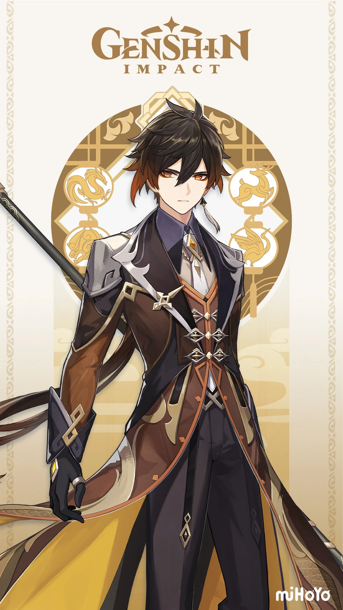
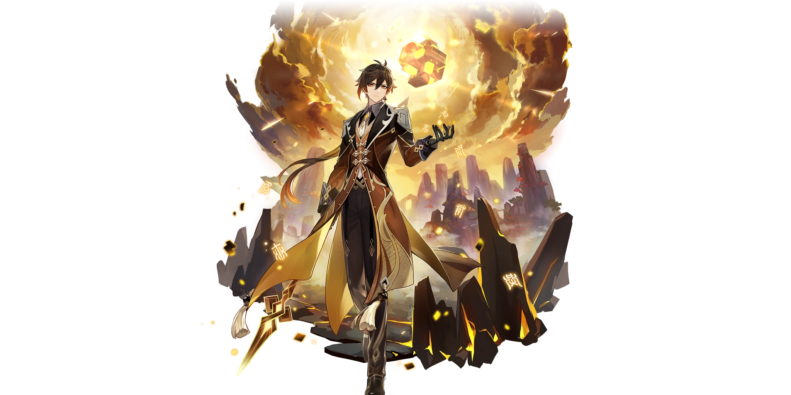

# Zhongli


Visit [Zhongli Mains](%20https://discord.gg/3h5uepPXKr) for more in-depth analysis on the Geo Archon!


## Official Art















## **Preface**

Zhongli's rise to power since his buffs in 1.3 has left many Genshin Impact players wishing that they had pulled on his banner. Between a global RES shred and stronger shield, the Geo Archon has rocketed in value since his troubled release.

### **Support**

At level 70, a +20 flower, and talent level 6 in Dominus Lapidis, Zhongli is casting a 4,820 health shield with 150% damage absorption. His damage is pretty weak for shield-bot gameplay, but his utility and the comfort that he offers cannot be understated as you approach the endgame.

* **Pros:**
  * Strong Jade Shield that provides stagger resistance and elemental and physical shred.
  * Extremely flexible for players that clear DPS checks with three characters.
  * Makes the game comfortable to play with Jade Shield's one stop shop utility.
  * Planet Befall has extremely long invulnerability frames.
  * RES shred for a potential 20 seconds can offer \(less\) increased damage for less work than Viridescent Venerer.
  * In Geo quickswap teams, his resonance damage off his Stone Steele is impressive.
* **Cons:**
  * His petrify is fairly short, but it buys breathing time.
  * Using his Planet Befall takes a long time to cast and typically is a DPS loss in the later portions of the game.

### **Physical Carry**

Physical carry Zhongli can make use of his global shred and abuse his fast auto attacks with Crescent Pike to push his physical damage further. With his buffs in 1.3, he has more room to deviate from Crescent Pike and can consider using Primordial Jade-Winged Spear or the Staff of Homa. 

* **Pros:**
  * R3 Crescent Pike is easily achievable, as the game rewards three northlander polearm prototypes.
  * Zhongli is completely self sufficient as a DPS unit, leaving a lot of freedom for his team compositions.
  * Zhongli can empower his supports while on field with Crescent Pike to push the total team damage further.
  * Extremely safe as a DPS unit because of his shield and petrify.
  * His resistance shred still supports his team just as much as his support builds.
* **Cons:**
  * The ceiling on Zhongli's physical damage output is not that high compared to the hypercarries in the game, but is more than capable of reaching equivalent or higher total team damage output against viable carries like Razor or Keqing.

### **Credits**

Artesians\#0002  
Noahboy88\#8888  
Coronaus\#0001  
Finrod\#8406  
IceKane\#0689  

r/Zhonglimains  
r/Keqingmains

## **Weapons**

### HP Timepiece

### ATK% Timepiece

### Physical DMG

Per Coronaus:

> Staff of Homa is an exceptionally strong spear on support and Geo DPS Zhongli builds, being BiS for the first, and a contender for the latter. With a support Zhongli build, It is the numerically best option. Other high tier options such as PJWS require more field time to achieve higher damage where as Homa allows that damage right off the bat, allowing you to optimize time on your DPS. It also provide solid additional shielding with it HP% passive boost. A large point to note is Homa's strength at lower HP. It is very strong but in many situations not ideal to rely on the bonus damage gained from its passive, although a good method of exploiting this can be done in abyss by intentionally taking damage on a lower floor that you have already cleared or no longer are constrained by time on. It beats out PJWS with neither having stacks, making it the most optimal weapon for this build type.
>
> In a Geo DPS build, much of the same holds true in Homa's strengths. PJWS does win in damage here for the reason of Zhongli having much more field time in this scenario, allowing it to stack and obtain higher damage. While Homa does still win in damage below 50% HP, it's far less optimal to obtain that buff than PJWS's buff simply by dealing damage. It should be noted that it's high damage allows it to edge out Vortex Vanquisher and establish itself as the second most optimal weapon for this playstyle but only by small margins.
>
> **In a physical DPS build, Crescent Pike is still BiS.**
>
> Staff of Homa scales extremely well with refinements due to gaining scaling on both the HP to ATK conversion ratio and the HP gained from the passive. It is a solid spear to roll for if you lack a spear that is as strong or stronger than Deathmatch for support and Geo DPS Zhongli builds.

## **Talent Priority**

### Support

Planet Befall &gt; Dominus Lapidis &gt; Normal Attack: Rain of Stone

Planet Befall has the highest talent scaling of any single ability in the game and ramps up quite sharply every talent upgrade \(65% per talent level\) and the petrified status gets longer. Dominus Lapidis gets power from going beyond talent level 6, but the effects may not be as noticeable as dropping his Burst.

### Physical Carry

Normal Attack: Rain of Stone &gt; Planet Befall &gt; Dominus Lapidis

Simple, enough, Rain of Stone will provide your higher talent values per second on your autos. Planet Befall gets more petrification time and damage.

## **Constellations**

#### **C1: Rock, the Backbone of Earth**

_Increase the maximum amount of Stone Steles created by Dominus Lapidis that may exist simultaneously to 2._

Increases the area of AoE when used in tandem with the Geo MC's burst constructs. It's an indirect buff to his energy recharge.

#### **C2: Stone, the Cradle of Jade**

_Planet Befall grants nearby characters on the field a Jade Shield when it descends._

Offers immense utility for support Zhongli builds, making refreshing his shield and using his burst cost half the time. Stone Steele repositioning is significantly easier. Also works in co-op.

#### **C4: Topaz, Unbreakable and Fearless**

_Increases Planet Befall’s AoE by 20% and increases the duration of Petrification by 2 seconds._

Significant utility boon for his Planet Befall.

**C5: Lazuli, Herald of the Order**

_Increases the level of Planet Befall by 3._

An additional 195% talent scaling is nothing to scoff at and leaves you at a potential 1034% talent percent at level 13.

#### **C6: Chrysos, Bounty of Dominator**

_When Jade Shield takes DMG, 40% of that incoming DMG is converted to HP for the current on-field character. A single instance of the regeneration cannot exceed 8% of the character’s Max HP._

This constellation has become a double edged sword for Zhongli with the release of the Staff of Homa and Hu Tao. Its value is now dependent on team composition and weapon choice.

## Artifacts

<table>
  <thead>
    <tr>
      <th style="text-align:left"><b>Playstyle</b>
      </th>
      <th style="text-align:left">Artifact Set</th>
    </tr>
  </thead>
  <tbody>
    <tr>
      <td style="text-align:left">Support</td>
      <td style="text-align:left">
        
<b>Archaic Petra (2) + Noblesse Oblige (2) </b>
        

        
A strong bread and butter artifact set for Zhongli. Archaic Petra and
          Noblesse Oblige make swapping to Zhongli for a little more damage more
          palatable.

        

        
<b>Noblesse Oblige (4)</b>
        

        
Zhongli makes a decent user of Noblesse Oblige for team damage.

      </td>
    </tr>
    <tr>
      <td style="text-align:left">Physical Carry</td>
      <td style="text-align:left">
        
<b>Gladiator&apos;s Triumph (4) </b>By far his strongest option for
          physical damage output.
           
        

        
<b>Gladiator&apos;s Triumph (2) + Bloodstained Chivalry (2)</b>
        

        
<b>Retracing Bolide (4)</b>
        

      </td>
    </tr>
    <tr>
      <td style="text-align:left">Additional Notes</td>
      <td style="text-align:left">For main stat choices on his timepiece, you can run HP% for stronger Jade
        Shields on support, and ATK% for more damage. The circlet should still
        be CRIT, and the goblet is Geo DMG%.</td>
    </tr>
  </tbody>
</table>

## **How To Play Zhongli**

### Support

Zhongli as a support is not a particularly cerebral character to play. You swap to him to refresh his Jade Shield and drop Planet Befall and swap back. Occasionally you can use his E to reposition, but at lower investments and without other Geo constructs, it might not be worth it.

As for team compositions, his value extends far and wide. With stagger resistance, universal resistance shred, and a strong shield that can last for 20 seconds, its very clear to see his strength as a support. For particular synergies, he works very well with Ganyu and Xiao to shred resistances and offer them the stagger resistance they so direly appreciate. He fits universally in nearly every type of composition as long as you can keep his Stone Steele from reducing elemental gauges and his resistance shred is weaker than Viridescent Venerer for mono-element compositions.

| Composition | Notes |
| :--- | :--- |
|   | Zhongli as a support is pretty much a universally strong choice, however Ningguang carry with Zhongli support with any kind of passive damage like Fischl, Xiangling, Xingqiu, or Bennett is fantastic. Post 1.3, Ningguang with Zhongli have a Geo resonance that has a 15% DMG increase and a combined 40% Geo RES down, allowing these two to output similar damage to C0 Vaporize Diluc. |

### **Physical Carry**

For physical Zhongli, his combos for proper damage output changes on your choice of weaponry. For Crescent Pike users, optimal damage is using N4 cancels by sprinting after the spear kick. It is recommended to use Superconduct with Fischl and Geo resonance to push his damage profile further. For 5\* weapons, N4 spear kicks into a Charged Attack yield strong results. In general, his team compositions are fluid and you can take your pick of the litter in terms of sub-DPS units.

There are several advanced combos that you can use to increase your damage profile. Not only can Zhongli do his N4 Spear Kick, he can also do N7 E taps, where his attack knocks back, and the E pillar will knock up small enemies for fall damage. Furthermore, he also has a Jump Plunge cancel ****that can follow up on his normal attack string.



\*\*\*\*

#### **Small selection of sample team compositions:**

| Composition | Notes |
| :--- | :--- |
|  | Zhongli DPS with Geo resonance while strong sub-DPS's are empowered by his Jade Shield resistance shred. |
|  | "Microwave" composition that allows you to play around his resonance with GeoMC. You can replace Bennett with Fischl for significantly more energy to play quickswap. |
|  | A fairly standard composition with Superconduct Fischl echoes and Geo resonance. |

## \*\*\*\*

## **Changelog**

2/27 - Zhongli Guide opened.

**Planned:**

