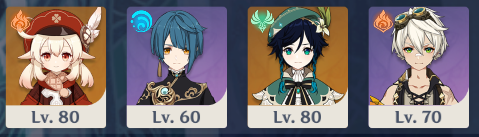
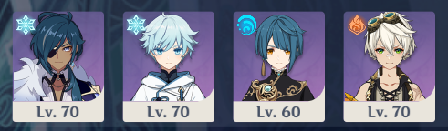
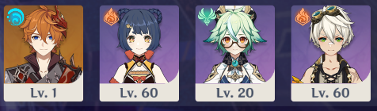

# Team Building Guide

## Definitions

* **A carry is the hero who spends the most time on the field, and deals the most damage**
* **A support is any other hero**
* **A rotation is the time taken to have each character in the team switch in, do what they need to do, and switch out again**

## Team Types

### Selfish Carry

**A selfish carry team is focused entirely around maximizing the damage dealt by a single carry hero, who remains on the field for around 15 seconds at a time.** This is usually Klee, Razor or Xiao because their elemental bursts end if they switch out. A selfish carry team will have a rotation time of 20 seconds or more - 15 seconds on the carry, then swap to the supports to set up for the next carry rotation.  

When building a selfish carry team, you generally want to get your carry to level 80, ascension 6, level 90 weapon, level 8-10 talents, and +20 artifacts before investing in supports. However, you do need to invest enough in your healer to heal enough and enough in your other supports to not get one-shot.  

Good carries for selfish carry teams either have an ability which requires them to remain on the field, or are capable of doing enormous amounts of damage with melt or vaporize.  

Good supports for selfish carry teams have long cooldowns on their abilities. They provide healing, elemental reactions, energy for the carry, or an on-field damage source. The damage dealt by supports is not as important, so heroes like Albedo provide value only once you’ve finished building the carry and have resources left over to invest in them.  

Selfish carry teams are very strong if you’ve started recently and don’t have a lot of resin available, as you only need to invest in a single hero to get value.

### **Sustained Damage Carry**

**A sustained damage team spends most of the time attacking with the carry, but switches out to supports reasonably frequently to use elemental skills and bursts.** This is the most common kind of team in Genshin Impact. A sustained damage team will have a rotation time of 15-20 seconds, though these teams tend not to use rigidly planned rotations.  

When building a sustained damage team, you generally want to get your carry to level 70, ascension 5, level 90 weapon, level 6-8 talents, and +20 artifacts before investing in supports.  

Good carries for sustained damage teams have the ability to put out large amounts of damage with their normal or charged attacks without draining too much stamina.  

Good supports for sustained damage teams have moderate cooldowns \(~15 seconds\) on their abilities. Elements to react with, healing, and off-field damage are all valuable.

### **Short Rotation Carry**

**A short rotation carry team spends 6-8 seconds attacking with the carry per rotation, with supports filling in the rest of the time.** A short rotation carry team will have a rotation time of 12-15 seconds - the carry does their burst of damage, then each support rotates in to use their skill and/or burst.  

When building a short rotation carry team, you usually need to invest in both your carry and your supports. If you don’t have the resin for that, play the team as a sustained damage carry team until then. Your carry should be at least level 70, ascension 5, level 90 weapon, level 6-8 talents, and +20 artifacts. Your supports should be at least level 60, ascension 4, level 80 weapon, level 6 talents, and +16 artifacts.  

Good carries for short rotation carry teams have the ability to do a large amount of damage in a short window, such as Diluc’s attack-skill weave combo, or Keqing’s charged attack spam. tCarries with forced downtime, such as Tartaglia and Hu Tao, are a natural fit for a short rotation team.  

Good supports for short rotation teams often have 12 second cooldown bursts, which they can use off cooldown on a short rotation team. Elements to react with and burst damage are valuable. Favonius weapons are good choices, as short rotation teams are very energy hungry.  

If your carry has forced downtime, such as Tartaglia or Hu Tao, you need a way to fill in that downtime. Bennett is a good option because of his short skill cooldown, you can rotate Tartaglia - Bennett - Support - Support - Bennett to fill a 6 second gap. Running a second carry is usually not a good idea, because the supports for your first carry won’t be able to support your second carry, you lose out on a support hero, and you need to invest in both carries.  

Short rotation teams are impractical if you don’t have a lot of resin to invest, but are very strong once you’ve invested a lot in the entire team.

### Quickswap

**A quickswap team spends almost no time using normal or charged attacks, instead swapping very quickly to use elemental skills and bursts.** The energy provided by the elemental skills fuels the bursts. A quickswap team will have a rotation time of under 12 seconds.  

When building a quickswap team, you need at least level 60, ascension 4, level 80 weapon, level 6 talents, and +16 artifacts on all your heroes. Generally you want to have level 70, etc, on most of them.  

A quickswap team doesn’t have carries and supports as such, instead each hero spends a similar amount of time on the field and contributes a significant amount of damage output. Good heroes for quickswap teams have 6 second cooldowns on their skills and 12 second cooldowns on their bursts, and deal a lot of damage with them. Venti is extremely good on quickswap teams because of the energy generated by his A4 passive and because of his ability to group enemies for AoE skills. Energy generation and high burst damage are important.  

Quickswap teams usually require a lot of resin to be effective, and also benefit a lot from having 5-star heroes, high-constellation 4-star heroes, or best of all high-constellation 5-star heroes.

### **Other Teams**

A combo team aims to deal an enormous amount of damage very quickly with a combo such as Bennett + Mona + Tartaglia to clear an abyss floor in a single rotation. These teams require enormous investment in both resin and constellations.  

An off-field carry team has the “carry” who spends most of the time on the field enable an off-field damage dealer, instead of dealing damage themselves. For example, a Sucrose-Fischl-Xingqiu team uses Sucrose’s attacks to trigger Fischl’s A4 passive, or a Childe-Xiangling team has Childe attack to set up hydro for Xiangling to vaporize. These teams work similarly to sustained or short rotation carry teams, but investment should be focused on the character that does the most damage instead of the character that spends the most time on the field.  

## **Team Suitability**

The following tables shows which teams each hero is most suitable for. Note that it’s only describing the best way to use a hero, not which hero is best for the team. Amber is best in sustained damage teams and Klee is only decent, but Klee is still a better sustained damage carry than Amber because Klee is a much stronger hero overall.

### Carry

| **Unit** | **Selfish Carry** | Sustained | Short Rotation | Quickswap |
| :--- | :---: | :---: | :---: | :---: |
| Amber | Bad | Best | Good | Bad |
| Diluc | Decent | Good | Best | Good |
| Ganyu | Decent | Best | Good | Good |
| Kaeya | Bad | Best | Good | Decent |
| Keqing \(electro\) | Bad | Bad | Best | Good |
| Keqing \(physical\) | Bad | Decent | Best | Bad |
| Klee | Best | Decent | Bad | Bad |
| Ningguang \(carry\)    | Bad | Decent | Best | Good |
| Noelle | Bad | Best | Bad | Bad |
| Razor | Best | Bad | Bad | Bad |
| Tartaglia | Bad | Bad | Best | Good |
| Xiangling \(carry\) | Bad | Best | Good | Bad\* |
| Xiao | Best | Bad | Bad | Bad |
| Zhongli | Bad | Best | Good | Bad\* |


Xiangling and Zhongli are bad in quickswap teams when built as Crescent Pike carries; they're better as elemental damage supports!


### Support

| **Unit** | **Selfish Carry** | **Sustained** | **Short Rotation** | **Quickswap** |
| :--- | :---: | :---: | :---: | :---: |
| Albedo | Good | Best | Good | Decent |
| Barbara | Best | Decent | Decent | Bad |
| Beidou | Bad | Best | Good | Bad |
| Bennett | Decent | Good | Best | Best |
| Chongyun | Bad | Best | Good | Good |
| Diona | Good | Best | Decent | Bad |
| Fischl | Good | Best | Good | Bad |
| Jean | Good | Good | Good | Best |
| Kaeya \(support\) | Decent\* | Best | Good | Good |
| Lisa | Bad | Best | Bad | Bad |
| Mona | Bad | Best | Good | Good |
| Ningguang \(support\) | Bad | Bad | Good | Best |
| Qiqi | Best | Good | Bad | Bad |
| Sucrose | Decent\*\* | Best | Good | Decent |
| Traveler \(Anemo\) | Bad | Decent | Best | Decent |
| Traveler \(Geo\) | Bad | Decent | Decent | Best |
| Venti | Bad | Good | Good | Best |
| Xiangling \(support\) | Decent | Best | Decent | Decent |
| Xingqiu | Best | Good | Good | Bad |
| Xinyan | Bad | Best | Decent | Bad |
| Zhongli \(support\)  | Good | Good | Best | Good |


**\*** Kaeya is good at enabling Superconduct for Razor but is otherwise bad on a selfish carry team.

\*\* Sucrose is good at providing energy to Xiao but is otherwise bad on a selfish carry team.


## **Elemental Reactions**

**If you’re building a team around elemental reactions, you nearly always want to build around one or maybe two reactions, as that lets you focus on maximizing the value of that reaction.** For example, if you put Fischl on a Diluc-Xingqiu vaporize team, you’ll lose a lot of damage from Vaporizing Diluc’s damage in exchange for a small amount of overload and electro-charged damage. If you put Beidou on a Kaeya-Xingqiu freeze team, you’ll burn off the frozen status with superconduct triggers.  

### Melt and Vaporize

**These damage-amplifying reactions are the strongest in the game.** It’s very important to have your largest damage sources trigger the reaction, which means having the corresponding element applied to the enemy before your largest damage source.

Most of the time, triggering a 1.5x reaction \(vaporize with pyro or melt with cryo\) will leave some of the initial \(aura\) element still on a target. A single application of hydro can enable two 1.5x vaporize reactions, and a single application of pyro can enable two 1.5x melt reactions. On the other hand, an application of pyro can only support one 2x hydro-vaporize, and an application of cryo can support only one 2x pyro-melt. This makes it much easier to reliably trigger 1.5x reactions than 2x reactions.  

Elemental attacks and abilities do not always apply elements every time they hit; most talents have an internal cooldown on elemental application. For example, Klee’s normal attacks do not apply pyro on every hit, meaning they cannot vaporize every hit even against a hydro slime. This can also make it difficult to set up reactions how you would like - even though Kaeya’s burst hits more frequently than Xiangling’s burst, it applies cryo less frequently. If you use both bursts at the same time, Kaeya’s burst will trigger the melt reaction for 1.5x damage and Xiangling will not trigger melt.  

In practice, this means that a melt/vaporize team will typically involve a pyro carry triggering Vaporize, or a cryo carry triggering Melt. Bennett and Amber are rare exceptions; their elemental applications have a long enough cooldown that you can reliably apply cryo in between the hits to trigger 2x pyro melts. Xingqiu is the best hydro-application support, and Xiangling the best pyro-application support.  

It’s not usually possible to support more than one vaporizer or melter on a team. Running Diluc + Xiangling + Xingqiu will apply too much pyro for Xingqiu to keep up, and you’ll end up burning off all the hydro from the enemy, applying pyro, and having Xingqiu trigger vaporize for tiny damage instead of Diluc or Xiangling triggering vaporize for a lot of damage. You can run Diluc + Bennett + Xingqiu, though, because Bennett only applies pyro occasionally.  

2x melt/vaporize reactions are still useful if you have large single damage instances such as Mona’s or Tartaglia’s burst.  

### Freeze

**Freeze teams get a huge amount of crit from Blizzard Strayer**, letting you charged attack with impunity, prevent Fatui from shielding, bypass Mitachurl shields, and not need to worry about enemy attacks.  

Kaeya, Chongyun and Ganyu are good cryo sources for a freeze team. Xingqiu is the best hydro source; Mona is less reliable, but doesn’t require you to use normal attacks.  

Claymore attacks and geo damage will shatter frozen enemies, which you want to avoid, so don’t run them on freeze teams. Occasional electro application for superconduct can be good, such as in a Keqing + Kaeya + Xingqiu freeze team, but too-frequent application will reduce the freeze duration.  
****  

### Superconduct

Superconduct is very useful for physical damage carries. It only needs to be applied occasionally for the physical resistance reduction; you can include other reactions on the team as well. If your physical carry isn’t electro or cryo, it may not be worth the trouble of superconducting, when you could use other reactions instead. For example, a Crescent Pike Xiangling carry would rather vaporize her burst than superconduct her normal attack string.

### Electro-Charged and Overload

These reactions don’t do all that much damage, and get most of their value from triggering Fischl’s A4 passive. Overload knocks small enemies back, meaning you’d often prefer to avoid triggering it in those fights.

### Swirl

The effects of swirl itself aren’t very relevant, what matters is the Viridescent Venerer bonus. Swirl doesn’t eat up much of the element it reacts with, so you don’t usually have to worry too much about it messing up your reactions. Swirl can trigger Fischl’s A4 passive, which is a nice bonus for swirling a lot.

### Crystallize

The crystallize shield isn’t strong enough to be worth worrying about. The Petra 4-piece bonus is often more trouble than it’s worth - you need the Petra support to pick up the crystal, and the time taken doing so can cost you more damage than the bonus provides. Keeping a crystallize shield up for geo resonance is worthwhile. Like Swirl, Crystallize doesn’t eat up too much aura so you don’t need to worry about a Zhongli or Albedo messing up your reactions.  

### Rate of Elemental Application

<table>
  <thead>
    <tr>
      <th style="text-align:left"><b>Unit</b>
      </th>
      <th style="text-align:left"><b>Description</b>
      </th>
    </tr>
  </thead>
  <tbody>
    <tr>
      <td style="text-align:left">Albedo</td>
      <td style="text-align:left">Applies geo roughly once every 3 seconds, safe to run on pretty much any
        team except Freeze.</td>
    </tr>
    <tr>
      <td style="text-align:left">Amber</td>
      <td style="text-align:left">Applies pyro with her charged shots roughly once every 2 seconds, potentially
        allowing them to 2x melt. Burst applies lots of small pyro ticks for a
        short time, which isn&#x2019;t very useful.</td>
    </tr>
    <tr>
      <td style="text-align:left">Barbara</td>
      <td style="text-align:left">Elemental skill can be used to help freeze enemies, but has too much downtime
        to be the only hydro source. Attacks are too weak to be worth considering.</td>
    </tr>
    <tr>
      <td style="text-align:left">Beidou</td>
      <td style="text-align:left">Burst applies electro very frequently, which is great for electro-charged
        and overload teams.</td>
    </tr>
    <tr>
      <td style="text-align:left">Bennett</td>
      <td style="text-align:left">When used as a carry, applies pyro every 2 seconds, slow enough that it
        can be used to trigger 2x melts.</td>
    </tr>
    <tr>
      <td style="text-align:left">Chongyun</td>
      <td style="text-align:left">Elemental infusion applies cryo every 1.5-2 seconds, fast enough to let
        Bennett melt but not Diluc or Xiangling. Bennett&#x2019;s E or Q can let
        Chongyun melt all 3 of his burst icicles, but most other pyro sources cannot.</td>
    </tr>
    <tr>
      <td style="text-align:left">Diluc</td>
      <td style="text-align:left">Applies pyro on roughly half his normal attacks and all of his elemental
        skill uses. Xingqiu lets him vaporize all of these.</td>
    </tr>
    <tr>
      <td style="text-align:left">Diona</td>
      <td style="text-align:left">Applies cryo roughly once every 3 seconds with her burst, which can enable
        freeze or superconduct but not melt</td>
    </tr>
    <tr>
      <td style="text-align:left">Fischl</td>
      <td style="text-align:left">
        
Oz applies electro four times during its duration. Her A4 and C6 passives
          also apply electro. If an Oz attack triggers overcharged or superconduct,
          it will generate a particle for every enemy hit, which can be an amazing
          energy source. You want fast pyro or cryo application to enable this.
           
        

        
On the other hand, you need the active character to trigger the reaction
          for her A4 passive to work, which means having an off-field support provide
          the aura and the active character provide the trigger. How exactly electro-charged
          interacts with this is beyond the comprehension of mortals, but it does
          seem to work.
           
        

      </td>
    </tr>
    <tr>
      <td style="text-align:left">Ganyu</td>
      <td style="text-align:left">Applies two cryo instances with a charged attack, and one roughly every
        3 seconds with her burst. Xiangling lets her melt her charged attacks.
        If you use Ganyu and Xiangling bursts at the same time, Ganyu&#x2019;s
        burst will melt most of its hits and her charged attacks won&#x2019;t melt.
        Ganyu&#x2019;s burst can&#x2019;t enable pyro heroes to melt, but can enable
        freeze and superconduct.</td>
    </tr>
    <tr>
      <td style="text-align:left">Jean</td>
      <td style="text-align:left">Can use a Viridescent Venerer set pretty well by using constantly using
        her skill.</td>
    </tr>
    <tr>
      <td style="text-align:left">Kaeya</td>
      <td style="text-align:left">Applies cryo roughly once every 3 seconds. Enables superconduct and freeze
        fairly well. Doesn&#x2019;t apply cryo fast enough to enable 2x melt, and
        doesn&#x2019;t do enough damage to be worth 1.5x melting.</td>
    </tr>
    <tr>
      <td style="text-align:left">Keqing</td>
      <td style="text-align:left">Electro Keqing applies electro reasonably quickly to enable electro-charged
        or overload teams. Physical Keqing applies electro frequently enough to
        keep Superconduct up, but slowly enough that it doesn&#x2019;t interfere
        with Freeze.</td>
    </tr>
    <tr>
      <td style="text-align:left">Klee</td>
      <td style="text-align:left">Applies pyro quite frequently, though internal cooldowns mean that you
        aren&#x2019;t applying pyro with every normal attack or burst hit. Xingqiu
        lets her vaporize most of her damage, but she still misses vaporizes more
        often than Diluc.</td>
    </tr>
    <tr>
      <td style="text-align:left">Lisa</td>
      <td style="text-align:left">Doesn&#x2019;t do enough to justify running her over Fischl or Beidou,
        ever.</td>
    </tr>
    <tr>
      <td style="text-align:left">Mona</td>
      <td style="text-align:left">Vaporizing Mona&#x2019;s burst does a ton of damage, but can be tricky
        to execute. She&#x2019;s an adequate enabler for Freeze; her hydro application
        has downtime but Freeze enhances the duration of her Omen debuff.</td>
    </tr>
    <tr>
      <td style="text-align:left">Ningguang</td>
      <td style="text-align:left">Applies geo roughly every 2 seconds with normal and charged attacks. Doesn&#x2019;t
        really interact with elemental reactions much, but can trigger Fischl A4.</td>
    </tr>
    <tr>
      <td style="text-align:left">Noelle</td>
      <td style="text-align:left">Can trigger Fischl&apos;s A4 with Crystallize; she doesn&apos;t apply
        geo often enough to make this worthwhile on her own but can combo with
        Xingqiu and Beidou for a decent taser team.</td>
    </tr>
    <tr>
      <td style="text-align:left">Qiqi</td>
      <td style="text-align:left">Reasonable at supporting superconduct and freeze, but you&apos;ll want
        another cryo on the team to cover Qiqi&apos;s downtime.</td>
    </tr>
    <tr>
      <td style="text-align:left">Razor</td>
      <td style="text-align:left">A cryo support for superconduct is necessary to enable Razor&#x2019;s
        physical damage potential. Electro-charged doesn&#x2019;t do much for Razor,
        and Overload is usually harmful.</td>
    </tr>
    <tr>
      <td style="text-align:left">Sucrose</td>
      <td style="text-align:left">Very good Venerer support, since her entire kit can Swirl.</td>
    </tr>
    <tr>
      <td style="text-align:left">Tartaglia</td>
      <td style="text-align:left">Applies hydro very fast in melee form, enabling a pyro-vape Xiangling
        or a lot of A4 triggers with a C6 Fischl. Getting a 2x vaporize on his
        elemental burst deals a lot of damage.</td>
    </tr>
    <tr>
      <td style="text-align:left">Traveler (Anemo)</td>
      <td style="text-align:left">An adequate Venerer support; decent but not better than other anemo supports.</td>
    </tr>
    <tr>
      <td style="text-align:left">Traveler (Geo)</td>
      <td style="text-align:left">Doesn&apos;t apply much geo, so won&apos;t interfere with reactions.</td>
    </tr>
    <tr>
      <td style="text-align:left">Venti</td>
      <td style="text-align:left">Venti will apply the element infused in his elemental burst extremely
        frequently. A cryo-infused Venti burst can enable 2x melts from Diluc.
        Also a great Venerer support.</td>
    </tr>
    <tr>
      <td style="text-align:left">Xiangling</td>
      <td style="text-align:left">The fastest off-field pyro applier with her burst; Guoba also does some
        application but is unreliable. Every burst hit applies pyro. Good at setting
        up a melt carry or getting her burst vaporized; only a cryo-infused Venti
        burst can apply cryo fast enough for Xiangling to trigger Melt.</td>
    </tr>
    <tr>
      <td style="text-align:left">Xiao</td>
      <td style="text-align:left">Can&#x2019;t get much value out of Venerer because he&#x2019;s the main
        damage dealer. Can trigger Fischl A4 frequently, though.</td>
    </tr>
    <tr>
      <td style="text-align:left">Xingqiu</td>
      <td style="text-align:left">The best overall reaction support in the game. Every attack with his burst
        active will apply hydro, enabling vaporize, freeze and electro-charged
        teams.</td>
    </tr>
    <tr>
      <td style="text-align:left">Xinyan</td>
      <td style="text-align:left">Applies just enough pyro to mess up her teammates&#x2019; reactions but
        not enough to support, so you&apos;d rather use someone else.</td>
    </tr>
    <tr>
      <td style="text-align:left">Zhongli</td>
      <td style="text-align:left">Applies Geo roughly once every 3 seconds, generally won&#x2019;t mess
        up your team&#x2019;s reactions.</td>
    </tr>
  </tbody>
</table>

## Energy

**The main way of generating energy is from elemental skills.** They generate elemental particles, which give energy to your team. The active hero will gain more energy than inactive heroes, and heroes who have the same element as the particle will get more energy than heroes with different elements. You can get energy by having multiple heroes of the same element in order to get more out of each particle. Damaging and killing enemies also generates particles, which will most often be picked up by your carry because they spend the most time on the field.  

You should identify which heroes have the most important elemental bursts, and build your team around giving them enough energy, usually by having another hero of the same element. Having multiple heroes of the same element also lets you swap heroes while particles are in the air without losing energy, increasing your overall DPS. Having energy regeneration artifacts and/or weapons helps of course, though this trades off against damage. Favonius weapons are good at providing energy to the entire team.  

If you’ve got a hero that needs a lot of energy, you can have another hero of the same element use their elemental skill, then swap to the energy-hungry hero to pick up the particles.  

Quickswap teams, which use elemental skills very frequently, generate the most energy. Selfish carry teams generate the least.  

| **Unit** | Energy Generation | **Energy Needs** |
| :--- | :--- | :--- |
| Albedo | Good | His skill does most of his damage, not his burst, so you don’t need to worry about bursting off cooldown. |
| Amber | Poor | Her burst isn't that important. |
| Barbara | None | She doesn’t rely solely on her burst to heal, so you usually won’t need it off cooldown. Doesn’t generate any energy for the team, and very little for herself at C1. |
| Beidou | Decent | Needs a ton of energy, and has a hard time using Sacrificial Greatsword to get it. Works best with Fischl. |
| Bennett | Good/Great | Carry Bennett can easily supply himself and his team; support Bennett has moderate energy needs and works best with another pyro hero. You might struggle if you’re using Aquila Favonia or Prototype Rancour over an ER weapon to maximize his burst value. |
| Chongyun | Poor | Doesn't need his burst to do his job, so it's fine not using it off cooldown. |
| Diluc | Good | Can fund himself fairly well, but works best with another pyro on the team. |
| Diona | Decent | Works best with Sacrificial Bow. Can build max ER because she doesn’t need damage. |
| Fischl | Great/Fantastic | Doesn’t need to burst off cooldown because her elemental skill gives some uptime. Generates absurd amounts of energy if she triggers overload or superconduct. |
| Ganyu | Decent | Doesn't rely on her burst, especially in a melt team. |
| Jean | Good | Needs only 60 energy every 20 seconds, and doesn't need to burst off cooldown. |
| Kaeya | Good/Great | Needs a lot of energy to burst off cooldown, which he wants to do, but provides quite a bit especially if he freezes enemies or can use his skill off cooldown. |
| Keqing | Poor | Doesn’t need her burst for damage if running a physical build. If building electro, works well with Fischl. |
| Klee | Decent | Doesn’t need her burst too much since it’s easier to vaporize reliably without it active. Her A4 gives a good amount of energy to the team. |
| Lisa | Poor | Needs a ton of energy to be effective, which means another electro unit. |
| Mona | Decent | Needs a lot of energy because her power is concentrated in her burst. Won’t usually have another hydro on the team because they lack synergy with Mona. |
| Ningguang | Decent/Great | Applies geo roughly every 2 seconds with normal and charged attacks. Doesn’t really interact with elemental reactions much, but can trigger Fischl A4. |
| Noelle | None | Needs a huge amount of energy to burst off cooldown, which she needs to do to be effective. C6 helps a little by extending her burst. You probably want 2 geo supports to feed her energy. |
| Qiqi | None | Needs a lot of energy to use her burst, although she can heal reasonably well without it. |
| Razor | Great | Absolutely needs to have his burst active at all times. Fischl helps enable that. |
| Sucrose | Decent | C1 helps you avoid wasting cooldowns. Sacrificial Fragments is very good at providing energy. Her burst is good but not absolutely necessary if she’s mostly a Venerer support. |
| Tartaglia | Good | If you’re vaporizing his burst he needs a fair bit of energy; if you’re using him as an enabler for Xiangling or Fischl it’s less important. |
| Traveler \(Anemo\) | Decent/Good | Needs quite a bit of energy, but gets some energy recharge from their free C2. |
| Traveler \(Geo\) | Great | Has an easy time bursting if there’s another geo on the team, which there should be since geo traveler is only good on geo teams. |
| Venti | Amazing | Needs a fair bit of energy to burst off cooldown, which you want to do. Jean works really well for this. His A4 is fantastic for giving energy to the team. |
| Xiangling | Poor | Extremely energy hungry. Works best if you’ve got another pyro feeding her energy. |
| Xiao | Poor | Absolutely requires his burst to be effective. Works best with anther anemo \(or two\) feeding him energy. |
| Xingqiu | Poor/Great\* | Absolutely needs energy to be effective. Sacrificial Sword is incredibly good; with it he can fund his own burst off cooldown, without he struggles immensely. |
| Xinyan | Poor | If you’re using her as a damage dealer she needs a lot of energy. If you’re using her as a shield + cleanse, she doesn’t. |
| Zhongli | Decent | His burst is powerful, but using it off cooldown usually requires another geo on the team. He still provides a lot of damage without it, and because of the long animation, going without is not a huge DPS loss. |


Xingqiu's energy generation goes from Poor to Great if he has a Sacrificial Sword!


## Sample Teams

### Selfish Carry

In this team, Xiao deals all the damage. Sucrose provides energy, and with C1 can use her elemental skill twice per rotation. Jean provides energy and heals. Zhongli gives a long-lasting shield and resistance shred.  

This team is built around enhancing Klee’s damage. Xingqiu enables vaporize; Venti provides resistance reduction and grouping; Bennett provides healing and a damage buff. Venti can be replaced by Sucrose if you don’t have him.

This is a free-to-play team that should be available to many players. Kaeya enables Superconduct to buff Razor, Fischl provides energy, and Barbara heals. It works well even with low investment in resin and constellations, but doesn’t scale very well late-game, and will struggle to 9-star later Abyss floors.

### **Sustained Damage Carry**

Chongyun and Kaeya enable Bennett to melt his elemental skill every 2 seconds for enormous damage. Bennett also enables Chongyun to melt his burst. Sucrose gives the Venerer debuff and boosts the team’s Elemental Mastery for better melts. You need to pay close attention to the elemental auras applied to the enemy. If an enemy ends up with a pyro aura, you need 3 cryo melts to burn it off. Kaeya and Sucrose are both flexible and can be replaced, though you can’t replace them with any hero that would burn off the cryo aura. Anemo, hydro and cryo heroes are safe, as are heroes that only apply elements when on-field like Ningguang.

This is one of the most potent damaging teams in the game. Ganyu does enormous damage melting Frostflake Arrows, and her burst combos very well with Venti.

Chongyun’s cryo infuse and Xingqiu’s burst enables Kaeya to freeze the enemy and deal a lot of damage with Blizzard Strayer-boosted charged attacks. Bennett is flexible; the team doesn’t necessarily need more healing than Xingqiu because freeze prevents the enemy from attacking.

Although this team shares many heroes with the previous team, it works quite differently. The goal is to melt most of Xiangling’s burst hits, and vaporize the rest. Xingqiu’s burst quickly clears off any pyro auras, which would otherwise result in 1.5x cryo melts ruining the combo. Xiangling is the main damage dealer; Kaeya spends the most time on the field and also does reasonable damage. Black Sword on Kaeya helps make up for the lack of a dedicated healer; Favonius weapons on Xiangling and/or Chongyun help a lot with energy.

The “taser” team is based around triggering Fischl’s A4 passive as much as possible with electro-charged and swirl. Sucrose spends the most time on field, but Fischl is the main damage dealer. Xingqiu and Beidou add a lot of damage to Sucrose’s otherwise worthless normal attacks. The stagger from electro-charged, damage reduction from Xingqiu, and counter from Beidou substitute for a healer. You can replace Beidou with Bennett, especially if you have C6 on Fischl.  

Crescent Pike Zhongli does reasonable damage with his attacks, while also reducing enemy resistance to boost the damage of Xiangling’s vaporized burst. Albedo is flexible; the team doesn’t need a healer because of Zhongli’s shield and Xingqiu’s damage reduction, but Bennett is still strong.  

### **Short Rotation Carry**

Xingqiu enables Diluc to vaporize, Zhongli provides resistance shred and a good low-cooldown burst, Bennett provides energy, buffs and heals.

Electro-charged from Keqing and Xingqiu enables Fischl’s A4 passive for lots of damage. Jean provides resistance shred with Viridescent Venerer, heals, and a short cooldown elemental skill. Electro resonance helps with the team’s energy needs.  

Ningguang and Albedo feed each other energy for frequent bursts, which are amplified by geo resonance. Crystallize triggers Fischl’s A4 passive for good damage.

Xiangling is the team’s primary damage dealer, though she doesn’t spend much time on the field. Bennett acts as carry while Tartaglia’s burst is on cooldown. Tartaglia uses E and attacks for 7 seconds to vaporize Xiangling’s burst, Sucrose provides grouping and resistance shred, Bennett provides energy, damage and healing. Constellation 4 on Xiangling is recommended.  

### Quickswap

This team is based around abusing the energy from “Turbo Fischl”. When Oz’s attacks trigger overload \(or superconduct\), they generate a particle for each enemy hit. This enables Beidou and Xiangling to burst off cooldown even if they choose attack weapons over energy recharge. The team has fewer short-cooldown abilities than most quickswap teams, but also doesn’t care about normal attack damage. Works best on abyss floors where you fight multiple large enemies simultaneously.

The traveler’s boulder explodes if there are more than 3 structures placed on the field, which you can do every 6 seconds with a boulder-pillar-flower rotation. All the structures also enable Zhongli’s pillar pulses, and you have a huge amount of energy generation for frequent bursts from all your heroes.

Venti and Jean do a lot of damage with their skills and bursts, while providing energy to each other to burst off cooldown. Bennett buffs damage. Chongyun’s burst does a lot of damage when melted on a low cooldown, and his C2 reduces the team’s cooldowns.

If you freeze an enemy affected by Mona’s Omen, the Omen remains until the enemy becomes unfrozen. A hydro-infused Venti burst combined with a Ganyu burst can keep an enemy frozen for a long time, and deal a huge amount of damage in the process.  
****

  

  

  

